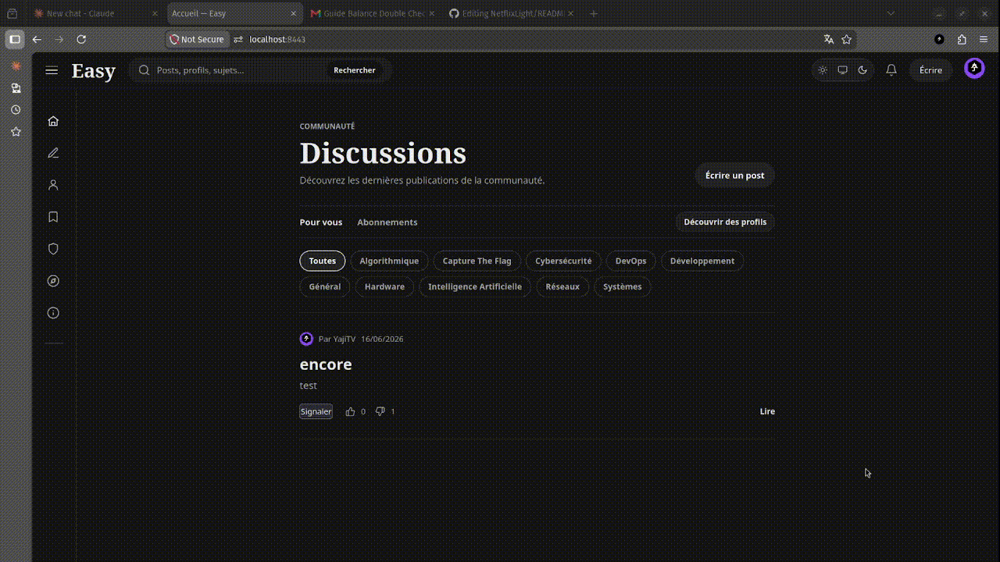

<div align="center">

# Easy

### Un forum communautaire, construit en Go & SQLite

[](https://go.dev/)
[](https://www.sqlite.org/)
[](https://www.docker.com/)
[](LICENSE)
[](https://localhost:8443)

[Fonctionnalités](#-fonctionnalités) • [Démarrage rapide](#-démarrage-rapide) • [Architecture](#-architecture) • [Routes principales](#-routes-principales) • [Sécurité](#-sécurité)

</div>

---

## ◆ Démo

<div align="center">



</div>

---

## ◆ Fonctionnalités

<table>
<tr>
<td width="50%">

### » Forum & Contenu
- **Posts multi-catégories**: Chaque post peut appartenir à plusieurs catégories
- **Images intégrées**: Upload JPEG/PNG/GIF avec validation du contenu décodé
- **Commentaires**: Imbriqués sur chaque post, modifiables par l'auteur
- **Likes & Dislikes**: Sur les posts et les commentaires
- **Filtres intelligents**: Par catégorie, posts créés, posts likés, fil "following"
- **Pages d'erreur custom**: 404, 403, 500 stylisées côté serveur

</td>
<td width="50%">

### » Authentification
- **Inscription / Connexion**: Email + username, validation côté serveur
- **Sessions UUID**: Expirantes, une seule session active par compte
- **OAuth Google & GitHub**: Liaison automatique par e-mail vérifié
- **Cookies sécurisés**: `HttpOnly`, `SameSite=Lax`, `Secure` en HTTPS
- **Hachage bcrypt**: Mots de passe jamais stockés en clair
- **Déconnexion propre**: Suppression de session en base

</td>
</tr>
<tr>
<td>

### » Social & Profils
- **Profils publics**: Photo de profil, bio, statistiques
- **Follows**: Suivre des utilisateurs, fil "following" dédié
- **Discover & Search**: Exploration et recherche d'utilisateurs
- **Bibliothèques**: Collections personnelles de posts sauvegardés
- **Activité personnelle**: Historique de ses posts, commentaires, likes
- **Notifications**: Forum, social et modération en temps réel

</td>
<td>

### » Modération
- **Système de rôles**: Utilisateur, modérateur, administrateur
- **Signalements**: Posts, commentaires, et comptes utilisateurs
- **Actions de modération**: Historique complet des décisions
- **Restrictions**: Mute et ban avec durée configurable
- **Mots-clés filtrés**: Liste de mots bloqués configurable
- **Rate limiting**: Global, authentification et actions d'écriture

</td>
</tr>
<tr>
<td colspan="2">

### » Expérience utilisateur
- **3 thèmes CSS**: Clair, sombre et automatique (système)
- **Zéro JavaScript obligatoire**: Navigation full server-rendered, HTML/CSS pur
- **HTTPS en dev**: Certificat auto-signé inclus via Docker
- **Déploiement Docker one-liner**: Base de données et uploads persistants

</td>
</tr>
</table>

---

## ✅ Couverture du sujet

| Bonus | Statut |
|-------|--------|
| OAuth Google & GitHub | ✅ Implémenté |
| Upload d'images avancé | ✅ JPEG, PNG, GIF, validation décodée, limite configurable |
| Modération | ✅ Implémenté |
| HTTPS & Rate limiting | ✅ HTTPS Docker dev, redirection HTTP, support reverse-proxy, limites en mémoire |
| Notifications & Activité personnelle | ✅ Implémenté |
| Chiffrement de la base de données | ✅ Implémenté |

---

## ▶ Démarrage rapide

### Prérequis

- [Docker](https://www.docker.com/) & Docker Compose
- *(Développement local uniquement)* Go `1.22.2+` et un compilateur C (CGO requis)

### Lancer avec Docker

```bash
# Démarrer toute la stack (build inclus)
docker compose -f docker/docker-compose.yml up --build
```

L'application est disponible sur :

```
http://localhost:8080   →  redirige automatiquement vers HTTPS
https://localhost:8443  →  application (certificat auto-signé, warning navigateur attendu)
```

### Arrêter

```bash
# Arrêter sans supprimer les données
docker compose -f docker/docker-compose.yml down

# Supprimer aussi la base et les uploads
docker compose -f docker/docker-compose.yml down --volumes
```

> Les données persistent dans les volumes Docker nommés `db_data` et `uploads`.

### Lancer en local (sans Docker)

```bash
go mod download
go run ./cmd/server
```

Disponible sur `http://localhost:8080` (HTTP uniquement, sans TLS configuré).

---

## ◆ Configuration

Configuration via variables d'environnement ou fichier `.env` (voir [`.env.example`](.env.example)).

<div align="center">

| Variable | Défaut | Description |
|----------|--------|-------------|
| `APP_ENV` | `dev` | Mode runtime : `dev` ou `prod` |
| `PORT` | `8080` | Port HTTP |
| `HTTPS_PORT` | `8443` | Port HTTPS (TLS interne activé) |
| `TLS_CERT_FILE` | *(vide)* | Chemin vers le certificat TLS |
| `TLS_KEY_FILE` | *(vide)* | Chemin vers la clé privée TLS |
| `DB_PATH` | `./data/forum.db` | Chemin vers la base SQLite |
| `UPLOAD_DIR` | `./uploads` | Répertoire des images uploadées |
| `MAX_UPLOAD_MB` | `20` | Taille max d'un upload en Mo |
| `SESSION_DURATION_H` | `24` | Durée de session en heures |
| `GOOGLE_OAUTH_ID` | *(vide)* | Client ID Google OAuth |
| `GOOGLE_OAUTH_KEY` | *(vide)* | Secret Google OAuth |
| `GITHUB_OAUTH_ID` | *(vide)* | Client ID GitHub OAuth App |
| `GITHUB_OAUTH_KEY` | *(vide)* | Secret GitHub OAuth App |
| `APP_BASE_PATH` | *(vide)* | Préfixe de chemin public, ex. `/easy` |
| `APP_PUBLIC_URL` | `https://localhost:8443` | URL publique canonique |
| `TRUST_PROXY` | `false` | Faire confiance aux headers forwarded |

</div>

---

## ◆ Déploiement derrière un reverse proxy

En production, le reverse proxy gère le TLS. Désactiver le TLS interne en laissant `TLS_CERT_FILE` et `TLS_KEY_FILE` vides :

```env
APP_ENV=prod
APP_BASE_PATH=/easy
APP_PUBLIC_URL=https://example.com/easy
TRUST_PROXY=true
TLS_CERT_FILE=
TLS_KEY_FILE=
```

Les callbacks OAuth doivent correspondre exactement :

```
https://example.com/easy/auth/google/callback
https://example.com/easy/auth/github/callback
```

> Easy utilise SQLite et du rate limiting en mémoire, **une seule instance** à la fois.

---

## ◆ Architecture

```
EasyForumGo/
├── cmd/server/              → Point d'entrée, démarrage et enregistrement des routes
├── config/                  → Chargement de la configuration (env vars + .env)
├── internal/
│   ├── handler/             → Handlers HTTP et rendu des templates
│   ├── middleware/          → Auth, restrictions, proxy, base path, rate limiting
│   ├── model/               → Structures de données de l'application
│   └── repository/          → Accès SQLite et application des migrations
├── migrations/              → 22+ fichiers SQL versionnés (schéma + seed)
├── pkg/
│   ├── utils/               → Helpers : mot de passe, UUID, upload
│   └── validator/           → Validation des inputs côté serveur
├── web/
│   ├── templates/           → Templates HTML server-rendered
│   └── static/              → CSS et images statiques
├── docker/                  → Dockerfile et configurations Compose (dev + prod)
├── docs/                    → Documentation technique et ERD
├── scripts/                 → Génération des certificats, déploiement
├── .env.example             → Exemple de configuration
└── README.md
```

---

## ◆ Base de données

Easy applique **22+ migrations** au démarrage et les trace dans `schema_migrations`.

<div align="center">

| Table | Rôle |
|-------|------|
| `users` | Comptes, rôles, profil et préférences sociales |
| `oauth_identities`, `oauth_pending_flows` | Multi-providers OAuth par compte |
| `sessions` | Sessions UUID expirantes (une par utilisateur) |
| `posts`, `categories`, `post_categories` | Posts du forum et catégories |
| `comments` | Commentaires sur les posts |
| `post_likes`, `comment_likes` | Likes et dislikes |
| `libraries`, `library_posts` | Collections personnelles de posts |
| `notifications` | Notifications forum, sociales et modération |
| `reports`, `moderation_actions`, `user_restrictions` | Signalements, historique, mute et ban |
| `user_follows` | Relations de following |
| `flagged_keywords`, `content_reviews` | Filtrage de contenu et revues |
| `schema_migrations` | Fichiers de migration appliqués |

</div>

Les clés étrangères SQLite et la suppression en cascade sont activées. Le diagramme ERD est disponible dans [`docs/ERD.svg`](docs/ERD.svg).

---

## ◆ Stack technique

<div align="center">

| Couche | Technologie |
|--------|-------------|
| **Langage** | Go `1.22.2`, stdlib uniquement (`net/http`, `html/template`, `database/sql`) |
| **Base de données** | SQLite via `github.com/mattn/go-sqlite3` (CGO) |
| **Authentification** | Sessions UUID + `golang.org/x/crypto` (bcrypt) |
| **OAuth** | Google & GitHub, liaison par e-mail vérifié |
| **IDs** | UUIDs via `github.com/google/uuid` |
| **Frontend** | HTML server-rendered + CSS pur, zéro framework JS |
| **Thèmes** | CSS-only : clair, sombre, système |
| **Conteneurisation** | Docker + Docker Compose (dev & prod) |

</div>

### Pourquoi Go stdlib uniquement ?
- → Aucun framework HTTP, routing et middleware maison
- → Compilation native, binaire unique, démarrage instantané
- → Maîtrise complète de la stack, rien de magique
- → Surface d'attaque minimale, dépendances réduites au strict nécessaire

---

## ◆ Routes principales

| Méthode | Route | Accès | Description |
|---------|-------|-------|-------------|
| `GET` | `/` | Public | Fil principal (filtres catégorie, feed following) |
| `GET` | `/post/{id}` | Public | Détail d'un post et ses commentaires |
| `GET/POST` | `/register`, `/login` | Public | Authentification |
| `POST` | `/logout` | Connecté | Fin de session |
| `GET/POST` | `/post/new` | Connecté | Créer un post |
| `GET/POST` | `/post/{id}/edit`, `/post/{id}/delete` | Auteur | Gérer un post |
| `POST` | `/post/{id}/comment` | Connecté | Commenter |
| `POST` | `/post/{id}/like`, `/post/{id}/dislike` | Connecté | Voter sur un post |
| `POST` | `/comment/{id}/like`, `/comment/{id}/dislike` | Connecté | Voter sur un commentaire |
| `GET` | `/profile/*`, `/settings`, `/library/*` | Connecté | Fonctionnalités personnelles |
| `GET` | `/notifications` | Connecté | Centre de notifications |
| `GET` | `/user/{username}`, `/discover`, `/search` | Public/Connecté | Social |
| `GET/POST` | `/auth/google/*`, `/auth/github/*` | Public | OAuth |
| `POST` | `/{post\|comment\|user}/{id}/report` | Connecté | Signalement |
| `GET/POST` | `/moderation/*`, `/admin/*` | Modérateur/Admin | Modération |

---

## ◆ Sécurité

- Mots de passe hachés avec **bcrypt**, jamais stockés en clair
- Tokens de session **UUID**, expiration, **une seule session active** par compte
- Cookies **`HttpOnly`**, **`SameSite=Lax`**, **`Secure`** en HTTPS
- Validation serveur de toutes les entrées + requêtes SQL paramétrées
- Vérification de **propriété** avant toute modification (post, commentaire)
- Clés étrangères SQLite + **suppression en cascade**
- Validation **d'image décodée** + limite de taille configurable
- **Rate limiting** global, sur l'authentification et les actions d'écriture (par session puis par IP)
- Application des rôles, du mute et du ban à la connexion
- Headers forwarded acceptés **uniquement si `TRUST_PROXY=true`**

---

## ◆ Vérification

```bash
# Formatage et compilation
gofmt -w .
go vet ./...
go build ./cmd/server

# Compilation de tous les packages (aucun test automatisé inclus)
go test ./...

# Validation Docker
docker compose -f docker/docker-compose.yml config
docker compose -f docker/docker-compose.yml up --build -d

# Smoke test
curl -I http://localhost:8080/
curl -k -I https://localhost:8443/
```

> Les workflows importants et la persistance doivent être vérifiés manuellement.

---

## ◆ Équipe

<div align="center">

| Membre | Rôle |
|--------|------|
| **Axel** | Développement front-end & back-end |
| **Mathys** | Développement front-end & back-end |
| **Baptiste** | Développement front-end & back-end |
| **Nine** | Développement front-end |

</div>

---

<div align="center">

Projet B1 · Ynov Campus · 2025–2026

</div>
